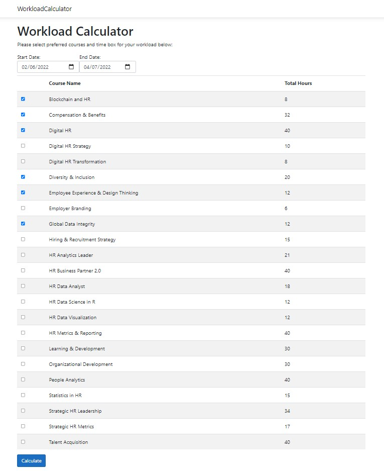
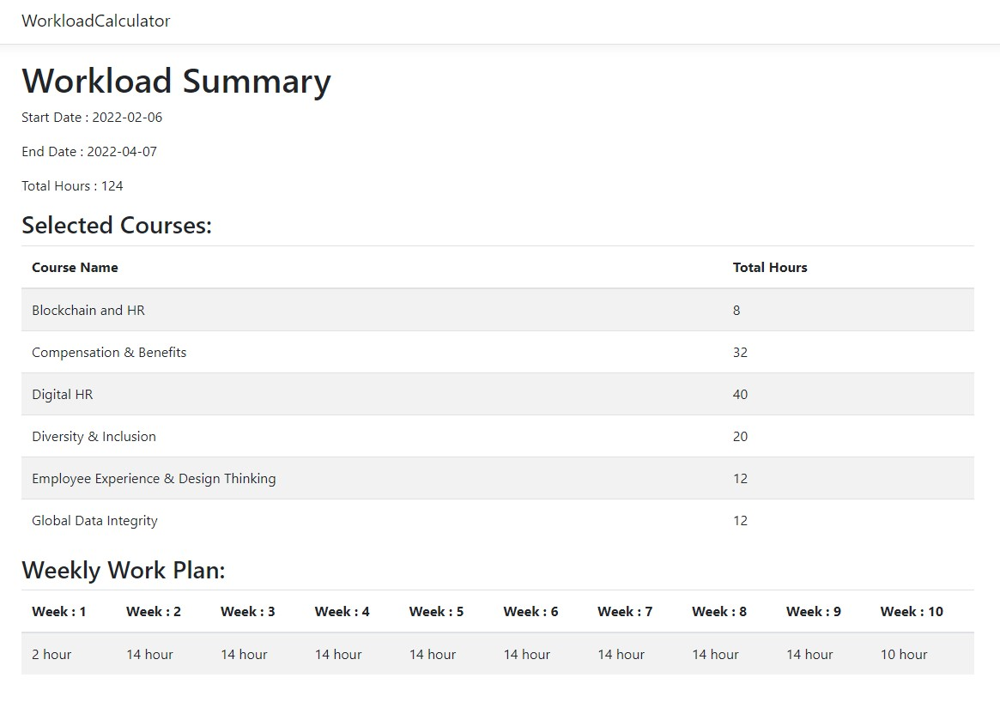

# Workload Calculator

This application includes an Angular app, which is connected to the Workload Calculator REST-API. Gets all courses from the database, lists them on the page. Users can select the start date, end date, and some of the courses from the list and click the calculate button. After clicking the "Calculate" button, workload data is saved to the database, and the user is redirected to the workload summary page. On the summary page, the user can see selected workload data and how many hours the student needs to study per week to complete all selected courses. I calculated the weekly work plan according to average daily work hours and days of weeks related to the selected date range.

## Technologies & Libraries & Frameworks

I used ASP.NET 5 Web API, ASP.NET Core with Angular, Azure SQL Database, Entity Framework Core, xUnit, Moq, AutoMapper  while developing the project. 

## Extendable & Improvable Parts Of The Project

• Unit test coverage should be increased writing for all of the work units of code.

• Exception Middleware can be extendable for different kinds of exceptions. We can inform the client more clearly and define the business rules about the application.

• Logger Middleware has to be written for collecting information, warnings, errors, and so on. 

• Authentication-Authorization structure should be included in the project because of the security and accessibility issues.

• Mediatr can be used If the project extends.

• We can use FluentValidator instead of If-Else blocks to check requests are valid or not regarding our business rules. We can manage specific validation flows as well.

• We can use the Azure Key vault to get secure data.

• For the frontend side, desing and usability should be better regarding to user needs. Also, some core services and different modules should be use if project extends.

## Workload Calculator:

## Workload Summary:

